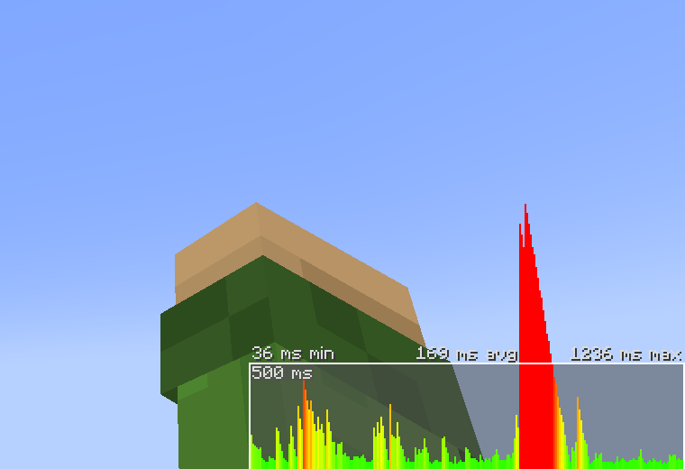

# How to beat the lag

There are several kinds of lag.

## FPS (frames per second)
This kind of lag is entirely **client-side**, meaning it depends entirely on your computer and Minecraft installation. Lower FPS means more lag. If you are experiencing issues with low FPS, you may want to explore modding to increase performance. A good starting point is usually the [Simply Optimized Modpack](https://modrinth.com/modpack/sop).

## TPS/MSPT (ticks per second/milliseconds per tick)
Minecraft runs on **ticks**. Every **tick** is a game update and runs entirely **server-side**. The target tick rate for Minecraft servers is 20 TPS, but laggy redstone contraptions, high volumes of new chunk generation or similar may cause a single game update to take more than 50 milliseconds (50 MSPT), which means that the server can't keep up with the speed things are normally meant to go. There is no way to definitively check whether this kind of lag (TPS below 20 or MSPT above 50) is occuring in Vanilla Minecraft, but there are several indicators this may be happening (given your ping is fine!):

* Eating takes a very long time
* Elytra take long to deactivate when landing
* Firework rockets trigger delayed

If you suspect there is an issue with tick rate on your instance, please create a ticket with staff in [our Discord server](https://purevanilla.co/discord) and try to keep it out of communication channels such as **#general**.

## Ping
**Ping** is the time it takes for data to travel between your computer and our server. It is usually measured in milliseconds. In Vanilla Minecraft, you can check the **ping** of your connection by pressing `F3+3` on your keyboard and reading the graph in the bottom right corner, which will show your ping over time.

Our server periodically experiences DDoS (Distributed Denial of Service) attacks which may overload our network infrastructure and lead to **ping spikes**.

We've hardened our **DDoS protection** since these attacks started. To distribute the load on our network and to offer better connectivity for players all over the world, PureVanilla uses **proxies**. Usually, when you connect to e.g. `play.purevanilla.co` we automatically route you to the proxy closest to you to offer you the best experience and lowest ping possible. During a DDoS attack though, this may not always be optimal; in that case, you may want to prioritize **ping stability** over **minimum ping**. For this purpose, we offer a range of hostnames to allow you to connect to a proxy in a **region of your choice** instead of an **automatically chosen one**. Note that some of these hostnames will contain multiple individual proxies themselves.

| Region | Hostname | Nr. subproxies | Full DDoS protection |
| ------ | -------- | -------------- | -------------------- |
| Australia | au.purevanilla.co | 1 | No |
| Europe | eu.purevanilla.co | 2 | Yes |
| Asia South-East | sg.purevanilla.co | 1 | No |
| US | us.purevanilla.co | 4 | Yes |
| US Central | central.us.purevanilla.co | 1 | Yes |
| US East | east.us.purevanilla.co | 1 | Yes |
| US West | west.us.purevanilla.co | 2 | Yes |

If your region matches a proxy with only partial DDoS protection and you are experiencing ping spikes, you may want to try out different proxies with **full** DDoS protection to find one that offers both a low average/minimum ping and does not suffer from a DDoS attack.