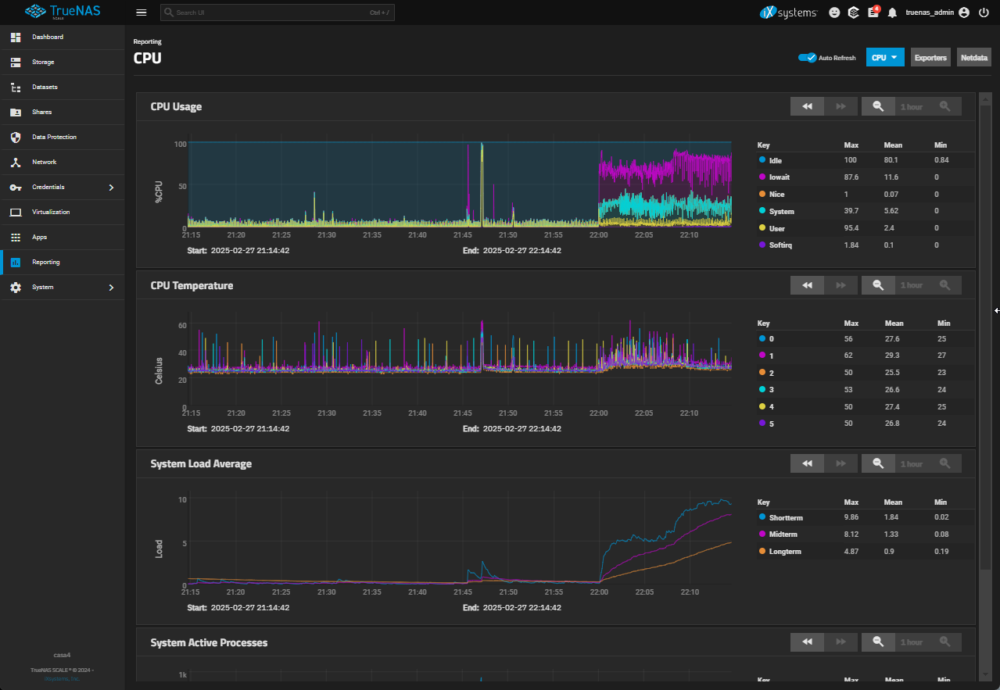
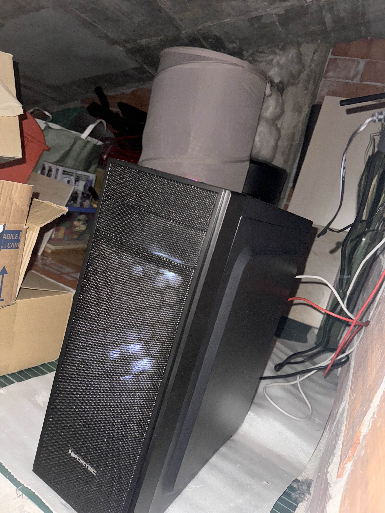

# Backups
The backup server itself is happy's old computer which now acts as a home server.

## Frequency
The server gets backed up to our backup server once every two hours. This is above the standard frequency for most servers, especially SMP servers, given the backup volume.

## Specs
| Component                | Specification                                                  |
|--------------------------|----------------------------------------------------------------|
| **CPU**                 | Intel(R) Core(TM) i5-8600K CPU @ 3.60GHz         |
| **RAM**                 | 16 GiB DDR4 |
| **OS**                 | TrueNAS-SCALE |
| **Motherboard**                 | MS-7B48 |

## Redundancy
The backup server uses multiple 6TB disk drives in a RAID configuration to keep all data safe. The server also features redundant network connectivity and power, ensuring backups are uninterrupted.

## Protocol
The backup is performed using rsync.

## Rollback Capacity
The backup uses ZFS with snapshot captabilities. The servers entire state is preserved in daily snapshots which can be rolled back to multiple weeks before the last backup was taken.

## Location
The server is located in a very safe but very memeable location, happy's attic.
