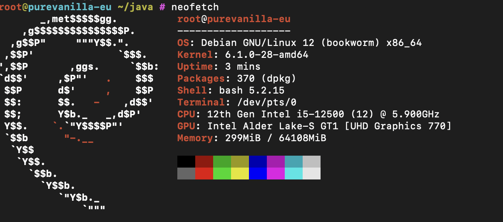

# Compute
The compute nodes are the machines dedicated to running PureVanilla's actual game servers (backend servers). We only use the highest quality hardware for our compute nodes, as they are the main factor to smooth gameplay.

PureVanilla currently uses two compute nodes.

## Nodes

### Node 0
Node 0 is the original compute node which ran all gamemodes up to 2025-05-18 15:39 UTC. Today, it is dedicated to the `cool` and `chill` gamemodes.

| | |
|-|-|
| **Processor** | Intel® Core™ i9-13900 |
| **Memory** | 64 GB DDR5 ECC |
| **Storage** | 2 x 1.92 TB NVMe SSD Datacenter Edition (Gen 4), SW RAID 1 |
| **Networking** | Gigabit |
| **OS** | Debian |

### Node 1
Node 1 was added on 2025-05-18 and went online at 18:12 UTC. It is dedicated to the `simply` gamemode.

| | |
|-|-|
| **Processor** | Intel® Core™ i5-12500 |
| **Memory** | 64108 MiB |
| **OS** | Debian 12 (Bookworm) |

*`neofetch` on Node 1*

## Water Consumption
Our compute nodes are 100% air cooled, and we use absolutely no water for heat dissipation.

## Energy Consumption
Our electricity is sourced from 100% renewable energies – mostly hydropower.

## Runtime
We run our servers using Docker running on top of Debian, managed by the serverbench.io daemon. We always run the latest versions for all of these tools.

## Tour
Video courtesy of der8auer in partnership with Hetzner.
