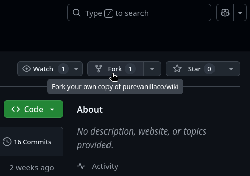
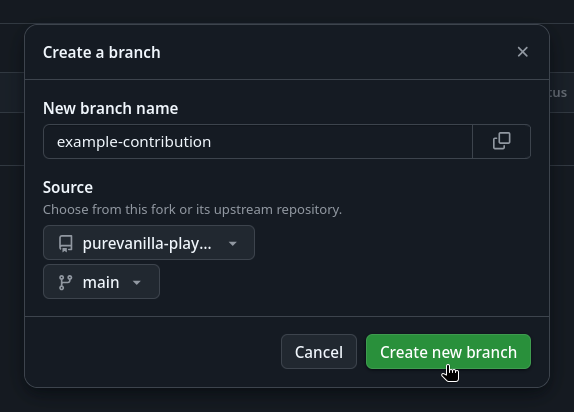
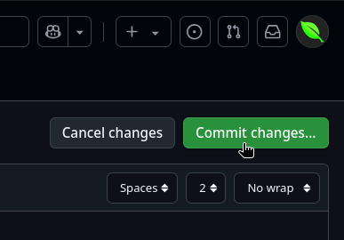

# Contribute to the Wiki

The PureVanilla wiki is a [Hugo](https://gohugo.io/) site deployed using [Cloudflare Pages](https://pages.cloudflare.com/) and its source is hosted openly at [our GitHub repository](https://github.com/purevanillaco/wiki).

To contribute to the Wiki, you will need a [GitHub](https://github.com/signup) account. Once you have created yours using the link, proceed with the steps below.

## Workspace setup


{}
1. Log into your [GitHub](https://github.com/login) account.
2. Navigate to [→ our GitHub repository](https://github.com/purevanillaco/wiki/) and fork it.



* We recommend using the name `pv-wiki` for your fork.


3. Create a new branch with a descriptive name for the changes you want to make. Click on the dropdown labeled "main", then click "View all branches".


* Click "New branch" in the top-right corner.


* Choose a name that reflects the changes you plan to make to the wiki and create the branch.



* Select the newly created branch by clicking on the dropdown labeled "main" once again and selecting your branch.


4. You can now make changes. Navigate to the `content/` directory to edit wiki articles.


* You can create new articles by clicking the "Add File" button in the top right and selecting "Create new file".


* Every article has their own folder with a file named `_index.md` which determines its content. You can create new files in new directories by typing a forward slash (`/`) in the new file name. Check out [Making Changes](#making-changes) for more details.


* Once you're done with a change, click on the "Commit changes" button in the top right.



* Enter a fitting commit message and commit your changes. Make sure to follow our [Commit style guide](#commits).


* You can also edit already existing articles by clicking the editing icon on a file.


5. Once you've made the changes you wanted to make, you can test them out on your own copy of the wiki. To do this, you first need to set up some things. First, click on the "Settings" tab on your repository.


* Now, click "Pages" on the left.


* Under "Build and deployment" select "GitHub Actions" on the "Source" dropdown.


* Navigate to "Environments" on the left.


* Select the `github-pages` environment.


* In the "Deployment branches and tags" section, click on "Edit" next to the rule enabling deployment from `main`.


* Replace the text `main` with a single asterisk `*`. (This is a wildcard and includes all branches)


6. You've now successfully set up deploying the wiki to GitHub pages. To deploy and view your changes, first click on the "Actions" tab at the top of the page.


* Click on "Deploy Hugo site to Pages" on the left


* You will see an info box saying "This workflow has a `workflow_dispatch` event trigger". Click on the "Run workflow" button next to it.


* Select the branch with the changes you want to view and click on the "Run workflow" button in the dialog box.


* You workflow has now been started. Click on it and wait for it to complete (green indicator). If the progress does not update, try reloading the page.


* Once the workflow has completed, click on the link below the "deploy" step.


* In case you're unable to locate this link, it usually follows this pattern (insert your own username):

```html
https://your-username.github.io/pv-wiki/
```

* You should now see your own copy of the wiki in your browser with your changes applied.


7. Check out the [Pull Requests section](#pull-requests) to find out how to have your changes be added to the official wiki page!

8. Thanks for contributing!

{}
{}
1. Install `git`
	* [→ Download here](https://git-scm.com/downloads)
2. Install the GitHub CLI
	* → Look for "GitHub CLI windows amd64 installer" [→ here](https://github.com/cli/cli/releases/latest), download and run it.
3. Log into your GitHub account in the GitHub CLI.
	1. Press `Windows+R` and enter `cmd`. Press the return key.
	2. Type `gh auth login` and Enter. If `gh` is not found, you may need to log out and back in or restart your computer to finalize the installation of the GitHub CLI.
	3. Follow the steps in your terminal.
4. Fork and clone our GitHub repository by running
```batch
gh repo fork purevanillaco/wiki --fork-name pv-wiki --clone
```
5. Move into the cloned repository by running
```batch
cd pv-wiki
```
6. Create a new branch with a name that is descriptive of the changes you plan to make. Run
```batch
git checkout -b <branch-name>
```
7. Install Hugo server.
	* Hugo is best installed [→ with a package manager](https://gohugo.io/installation/windows/#package-managers). We recommend using `winget` or, if unavailable, [→ Chocolatey](https://chocolatey.org/install#install-step2).
8. You are now ready to make changes! Check out the [Making Changes section](#making-changes). Also make sure to take a look at the [commit style guide](#commits).
9. Once you are done making changes, you can test them locally by running `hugo server` in the root folder of the repository (`pv-wiki`). The page will be built and hosted locally on your machine. Use your web browser to navigate to the address given by Hugo inside your terminal. If building the page fails, you may need to install Go first.
	* [→ Download here](https://go.dev/dl/): pick "Microsoft Windows" from the Featured Downloads and run the downloaded `.msi` file.
10. Sync your changes to your fork of the PureVanilla wiki by running `git push`. If it is your first time pushing from a new branch, do
```batch
git push -u origin <branch-name>
```
11. Check out the [Pull Requests section](#pull-requests) to find out how to have your changes be added to the official wiki page!
12. Thanks for contributing!
{}
{}
1. We strongly recommend using `homebrew` for the software you will need to contribute to and locally test the wiki on your macOS machine. You can install it by opening your terminal (look for "terminal" in Spotlight, `Cmd+Space` to open Spotlight) and running the command [→ here](https://brew.sh/#install).
2. With `homebrew` installed, installing all remaining software is much easier. Simply run
```bash
brew install git gh hugo go
```
3. Log into your GitHub account in the GitHub CLI by running
```bash
gh auth login
```
4. Fork and clone our GitHub repository by running
```bash
gh repo fork purevanillaco/wiki --fork-name pv-wiki --clone
```
5. Move into the cloned repository by running
```bash
cd pv-wiki
```
6. Create a new branch with a name that is descriptive of the changes you plan to make. Run
```bash
git checkout -b <branch-name>
```
8. You are now ready to make changes! Check out the [Making Changes section](#making-changes). Also make sure to take a look at the [commit style guide](#commits).
9. Once you are done making changes, you can test them locally by running `hugo server` in the root folder of the repository (`pv-wiki`). The page will be built and hosted locally on your machine. Use your web browser to navigate to the address given by Hugo inside your terminal.
10. Sync your changes to your fork of the PureVanilla wiki by running `git push`. If it is your first time pushing from a new branch, do
```bash
git push -u origin <branch-name>
```
11. Check out the [Pull Requests section](#pull-requests) to find out how to have your changes be added to the official wiki page!
12. Thanks for contributing!
{}
{}
1. To contribute, you will first need to install **git**, the **GitHub CLI**, **Go** and **Hugo** using your package manager of choice. Below are some options for popular distributions. If you are using a different distribution, use Google to locate the appropriate package name for your package repository.


{}
```bash
sudo apt install git gh golang-go hugo
```
{}
{}
```bash
sudo dnf install git gh golang hugo
```
{}
{}
```bash
sudo pacman -S git github-cli go hugo
```
{}
{}
```bash
brew install git gh hugo go
```
{}


2. Log into your GitHub account in the GitHub CLI using the terminal. Run
```bash
gh auth login
```
3. Fork and clone our GitHub repository by running
```bash
gh repo fork purevanillaco/wiki --fork-name pv-wiki --clone
```
4. Move into the cloned repository by running
```bash
cd pv-wiki
```
5. Create a new branch with a name that is descriptive of the changes you plan to make. Run
```bash
git checkout -b <branch-name>
```
6. You are now ready to make changes! Check out the [Making Changes section](#making-changes). Also make sure to take a look at the [commit style guide](#commits).
7. Once you are done making changes, you can test them locally by running `hugo server` in the root folder of the repository (`pv-wiki`). The page will be built and hosted locally on your machine. Use your web browser to navigate to the address given by Hugo inside your terminal.
8. Sync your changes to your fork of the PureVanilla wiki by running `git push`. If it is your first time pushing from a new branch, do
```bash
git push -u origin <branch-name>
```
9. Check out the [Pull Requests section](#pull-requests) to find out how to have your changes be added to the official wiki page!
10. Thanks for contributing!
{}


## Making changes
Once you've [set up your workspace](#workspace-setup), you can get started editing the wiki. You can find the Markdown documents from which the wiki is built in the `content/` subdirectory of the project folder. Please use American English for contributions in English.

### Markdown
Markdown is a simplified way to write decorated text, such as bold text or headlines. If you've ever used symbols to make text appear **\*\*bold\*\*** or *\*italicized\** on messenger platforms like WhatsApp or on Discord, you already know some Markdown!

If you need an overview on how to write Markdown, we recommend [this cheatsheet](https://www.markdownguide.org/cheat-sheet/).

Markdown files have the `.md` file extension and you will find them in the wikis content directory. The folder structure of the `content/` folder reflects the hierarchy of articles. The `_index.md` file is the Markdown file corresponding to the page described by the directory it's in; for example, `services/compute/_index.md` describes the [Services/Compute](/services/compute/) page.

### Hugo Book Theme
This wiki is not *just* Markdown; after all, it is rendered *from* Markdown into the pretty page that you're looking at right now. This is thanks to [Hugo](https://gohugo.io/), a framework for building static web sites. [Hugo](https://gohugo.io/) also allows for theming, and these themes do not only affect how a page looks but can also offer tools for making prettier pages.

We're using the [Hugo Book theme by Alex Shpak](https://github.com/alex-shpak/hugo-book), and it allows us to use some non-default page elements, such as tabbed content.

You can check out example uses of these elements on the [Hugo Book demo page](https://hugo-book-demo.netlify.app/) and learn how they are made in the [source code of the demo page](https://github.com/alex-shpak/hugo-book/tree/main/exampleSite).

### Git
After every change you make, make sure to **commit** it using `git`! `git` is the versioning tool we use to manage the wiki, and you will need to **commit** your changes so you can submit a **pull request** to our ("upstream") repository, which is a request for us to approve your change and add it to the wiki. If you've never used `git` before, we recommend you check out [this guide on basic `git` commands](https://docs.github.com/en/get-started/using-git/about-git#basic-git-commands).

## Commits
Commits are a milestone along the path of making changes to a codebase. Good commits are **atomic** and **descriptive**.

### Atomicity
An atomic commit is one which makes exactly **one** change. We know it's not always easy, but try to do this when contributing! It keeps things tidy and can make the review of your pull request faster!

**An example**

_instead of..._

`wiki: Add new article and another new article`
```md
+ # New article
+ 
+ Your inspiring words

+ # Another new article
+ 
+ More inspiring words
```

_better:_

`wiki: Add new article`
```md
+ # New article
+ 
+ Your inspiring words
```
`wiki: Add another new article`
```md
+ # Another new article
+ 
+ More inspiring words
```

### Descriptivity

Your commit message is your commits personality. It should give a good idea of what you changed, and do so concisely.

**An example**

* _bad:_ `git commit -m "Changed chill article"`
* _better:_ `git commit -m "Added chill2 instance"`


Sometimes, even atomic commits can be big, and we appreciate the time you put into them! That being said, remember that your commit message is something most people will only scan over and not read in its entirety, and it should still convey what you changed well enough. To achieve this, keep the first line of your commit message to 80 characters at most! If you absolutely need to convey more information than that, use multiple lines for your commit message.

```md
A short description of the change

A detailed description of every little thing you changed, modified, improved and did to achieve what you set out to achieve!
```

**An example**

* _bad:_ `git commit -m "Added the world download and seed information to chill and cool as well as the simply world downloads for the maps before the reset"`
* _better:_ `git commit -m "Add info for pre-reset maps"`

Not all commits are the same. A change to how the site is fundamentally rendered should not blend in with a bunch of spelling mistake corrections. To distinguish between commits, we use a system called [Conventional Commits](https://www.conventionalcommits.org/en/v1.0.0/). To sum it up, all your commit messages will look like this:

```md
type: Short description

A detailed description of every little thing you changed, modified, improved and did to achieve what you set out to achieve!
```

Where `type:` lets us classify commits in different ways. We use the following types:

* `wiki`: A change to an article.
* `index`: A change/addition of a page that merely points to other pages and contains no information in and of itself.
* `language`: Fixing a spelling or grammar mistake, or improving phrasing.
* `page`: A change to how the underlying page works.
* `workspace`: A change to the workspace.

> **Note:** This list of types is not exhaustive, and will probably fall short at some point in the future. You may use other types than are listed here. When you invent a new type which will likely be used in subsequent commits, please add it to this list so we can avoid a sprawl of loosely defined commit types.

Another thing to note about Conventional Commits is that after `type`, parentheses `(specifier)` may be used to make the commit message more specific, or an exlamation mark `!` to indicate a breaking change (which should be exceedingly rare for a wiki, but it's worth mentioning nonetheless).

**One last example**

This is what a good commit message might look like:

```md
wiki(simply1): Add information about old map

Added a download link and additional information about the simply1 map that reset on <date> as well as moving the seed information to the dedicated history section.
```

> **Note:** Don't stress too hard over this, often just having read this once and keeping it in the back of your mind will help you write a good commit message; you do not need to fit every single criterion of this guide perfectly.

## Pull Requests

A **pull request** is a *request* from you to us to *pull* the changes from your fork of the wiki into the official wiki repository and thus add them to the offical website.

Navigate to the GitHub page of your fork and make sure to be logged in & select the correct branch!

1. Press the "Contribute" button.


2. In the dialog that appears next, click "Open pull request".


3. Give your PR a descriptive title and detailed description, then submit it!


4. You're done! We will now review your changes and message you on the page of your pull request for any follow up questions. Once we've confirmed that your pull request follows our standards, we will merge it into the official repository and you'll be able to see it on the official page!